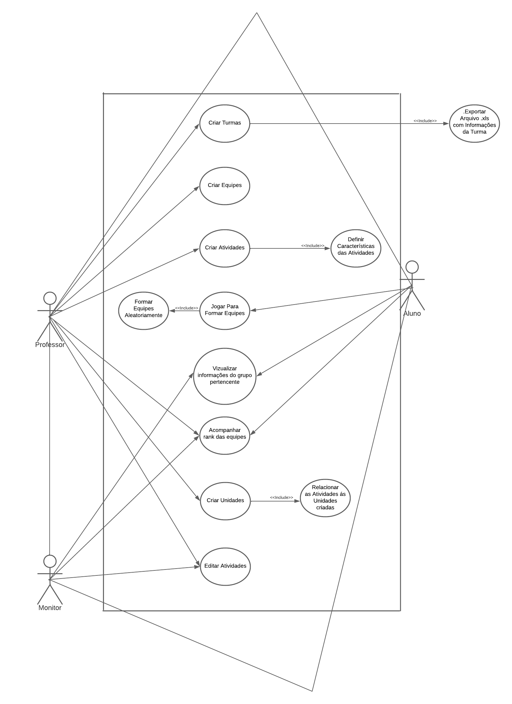

# Casos de Uso

## Diagrama UML

## Especificação de Caso de Uso: 

## 1 - Criar Turmas

### 1.1 - Breve descrição
O caso de uso “Criar Turmas” tem como objetivo dar ao professor da matéria de Requisitos de Software a capacidade de criar turmas e colocar informações dos alunos cadastrados para posteriormente a criação de equipes e organização dos dados relacionados a essa turma durante a matéria.

### 1.2 - Atores
1.2.1 - O professor deseja criar turmas.

### 1.3 - Fluxo Básico(FB)
1.3.1- O professor acessa o Software.

1.3.2- O sistema exibe a tela de criação de turmas, onde o professor pode exportar um arquivo .xls para criar as turmas.

1.3.3- O professor pode ajustar as turmas, adicionando ou removendo alunos conforme necessário.

1.3.4- O sistema registra as alterações feitas pelo professor e atualiza as informações da turma.

1.3.5- O professor finaliza o processo de criação de turmas e salva as alterações realizadas.

1.3.6- O sistema armazena as turmas criadas e os dados dos alunos alocados para uso posterior.

### 1.4 - Fluxo Alternativo(FA) 
1.4.1- O professor acessa o software.

1.4.2- O sistema exibe a tela de criação de turmas, onde o professor pode exportar um arquivo .xls para criar as turmas.

1.4.3- O professor decide importar um arquivo .xls contendo as informações dos alunos para criar as turmas.

1.4.4- O sistema processa o arquivo .xls e cria as turmas com base nas informações fornecidas.

1.4.5- O sistema exibe as turmas criadas na tela.

1.4.6- O professor percebe que é necessário ajustar as turmas.

1.4.7- O professor seleciona a opção de editar turmas ou informações dos alunos.

1.4.8- O sistema exibe as turmas atuais e fornece opções de edição.

1.4.9- O professor pode adicionar novos alunos às turmas, removê-los ou fazer outras modificações conforme necessário.

1.4.10- O sistema registra as alterações feitas pelo professor e atualiza as informações da turma.

1.4.11- O professor finaliza o processo de criação de turmas e salva as alterações realizadas.

1.4.12- O sistema armazena as turmas criadas e os dados dos alunos alocados para uso posterior.

### 1.5 - Fluxo de Exceção(FE)
Não possui.

### 1.6 - Condições Prévias
1.6.1 - Professor possuir o login autenticado como administrador.

### 1.7 - Pós-condições
1.7.1- O sistema possuir um banco de dados funcional.

### 1.8 - Ponto de Extensão
1.8.1- Excluir alunos cadastrados.

1.8.2- Notificar os alunos matriculados.

### 1.9 - Requisitos Especiais
1.9.1- Requisitos de usabilidade.

1.9.2- Requisitos de segurança.

1.9.3- Requisitos de flexibilidade.

## 2 - Criar Equipes

### 2.1 - Breve descrição
A feature proposta para o software é um gerador de equipes aleatórias com a finalidade de facilitar a formação de grupos de alunos e jogar um jogo para ampliar a dinâmica. Essa funcionalidade visa otimizar o processo de criação de equipes, de maneira justa e aleatória.

### 2.2 - Atores
2.2.1 - O professor deseja criar equipes.

### 2.3 - Fluxo Básico(FB)
2.3.1- O professor inicia o software e seleciona a opção de criar equipes.

2.3.2- O professor decide quantas equipes serão formadas.

2.3.3- As equipes são formadas aleatoriamente.

2.3.4- O software exibe as equipes geradas na tela, destacando os nomes dos alunos em cada equipe.

2.3.5- Os alunos jogam um jogo.

2.3.6- A partir dos resultados são propostas modificações nas equipes.

2.3.7- O professor pode analisar as modificações propostas e editar caso necessário.

2.3.8- O caso de uso é concluído, e o usuário pode sair do software ou realizar outras ações disponíveis.

### 2.4 - Fluxo Alternativo(FA) 
2.4.1- Após os resultados do jogo, o professor analisa se precisa de modificações nas equipes com base nos resultados formados.

2.4.2- O professor faz as modificações necessárias.

2.4.3- O professor realiza as edições necessárias nas equipes, considerando o desempenho dos alunos e buscando um equilíbrio adequado entre elas.

2.4.4- O professor atualiza as equipes no software de acordo com as alterações feitas.

2.4.5- O fluxo normal continua a partir do passo em que o caso de uso é concluído, permitindo ao professor sair do software ou realizar outras ações disponíveis.

### 2.5 - Fluxo de Exceção(FE)
2.5.1- O professor inicia o software e seleciona a opção de criar equipes.

2.5.2- O professor decide quantas equipes serão formadas.

2.5.3- As equipes são formadas aleatoriamente.

2.5.4- A partir dos resultados, percebe-se que os grupos não foram formados corretamente.

2.5.5- O professor identifica o problema e decide corrigir os grupos.

2.5.6- O professor seleciona a opção de editar equipes.

2.5.7- O software exibe as equipes atuais e fornece opções de modificação.

2.5.8- O professor realiza as alterações necessárias, como mover alunos entre equipes, excluir equipes ou adicionar novas equipes.

2.5.9- O professor confirma as alterações.

2.5.10- O software exibe as equipes atualizadas na tela, destacando os nomes dos alunos em cada equipe.

2.5.11- O caso de uso é concluído, e o usuário pode sair do software ou realizar outras ações disponíveis.

### 2.6 - Condições Prévias
2.6.1 - Professor possuir o login autenticado como administrador.

2.6.2 - O software é capaz de gerar as equipes aleatoriamente com base nos dados dos arquivos .xls.

### 2.7 - Pós-condições
2.7.1- As equipes foram formadas e estão prontas para serem exibidas.

2.7.2- O professor está habilitado à edição das equipes caso necessário.

### 2.8 - Ponto de Extensão
2.8.1-Possibilidade de editar equipes a qualquer momento.

### 2.9 - Requisitos Especiais
2.9.1- Requisitos de usabilidade.

2.9.2- Requisitos de segurança.

2.9.3- Requisitos de confiabilidade.

## 3 - Criar Atividades

### 3.1 - Breve descrição
O caso de uso “Criar Turmas” tem como objetivo dar ao professor da matéria de Requisitos de Software a capacidade de criar turmas e colocar informações dos alunos cadastrados para posteriormente a criação de equipes e organização dos dados relacionados a essa turma durante a matéria.

### 3.2 - Atores
3.2.1 - O professor deseja criar atividades.

### 3.3 - Fluxo Básico(FB)
3.3.1- O professor faz login no sistema.

3.3.2- O sistema exibe o painel principal do professor, com opções disponíveis.

3.3.3- O professor seleciona a opção de criar nova atividade.

3.3.4- O sistema exibe um formulário vazio para preencher os detalhes da atividade.

3.3.5- O professor preenche o campo "Descrição" com informações sobre a atividade.

3.3.6- Após preencher todos os campos necessários, o professor confirma a criação da atividade.

3.3.7- O sistema valida as informações inseridas pelo professor, verificando se todos os campos estão preenchidos corretamente.

3.3.8- O sistema salva as informações da atividade em um banco de dados ou sistema de armazenamento.

3.3.9- O sistema exibe uma mensagem de confirmação informando que a atividade foi criada com sucesso.

3.3.10- O professor pode optar por criar mais atividades ou realizar outras ações disponíveis no sistema.

3.3.11- O fluxo de eventos é encerrado.

### 3.4 - Fluxo Alternativo(FA) 
3.4.1- Após preencher todos os campos necessários, o professor confirma a criação da atividade.

3.4.2- O professor pode alterar algumas informações posteriormente.

3.4.3- O professor aperta na função de editar.

3.4.4- O professor altera as informações da atividade necessárias.

3.4.5- O professor aperta em salvar as alterações.

3.4.6- O sistema valida novamente as informações inseridas pelo professor.

3.4.7- O sistema salva as informações da atividade em um banco de dados ou sistema de armazenamento.

3.4.8- O fluxo normal continua a partir do passo em que o professor pode optar por criar mais atividades ou realizar outras ações disponíveis no sistema.

### 3.5 - Fluxo de Exceção(FE)
3.5.1- Após preencher todos os campos necessários, o professor confirma a criação da atividade.

3.5.2- O sistema valida as informações inseridas pelo professor, mas identifica que um dos campos obrigatórios não foi preenchido.

3.5.3- O sistema não permite a criação de atividade se todos os campos forem preenchidos.

3.5.4- O professor revisa o formulário e preenche o campo obrigatório que foi deixado em branco.

3.5.5- O professor confirma novamente a criação da atividade.

3.5.6- O sistema valida novamente as informações inseridas pelo professor e, dessa vez, todos os campos obrigatórios estão preenchidos corretamente.

3.5.7- O sistema salva as informações da atividade em um banco de dados ou sistema de armazenamento.

3.5.8- O fluxo normal continua a partir do passo em que o professor pode optar por criar mais atividades ou realizar outras ações disponíveis no sistema.

### 3.6 - Condições Prévias
3.6.1 - Professor possuir o login autenticado como administrador.

### 3.7 - Pós-condições
3.7.1 -O sistema deve ser capaz de armazenar as informações das atividades, seja em um banco de dados ou outro sistema de armazenamento.

3.7.2- O sistema permite que o professor possa editar ou remover atividades posteriormente, se necessário.

### 3.8 - Ponto de Extensão
3.8.1- Definir Critérios de Avaliação para a Atividade.

3.8.2- Associar Materiais Didáticos à Atividade.

### 3.9 - Requisitos Especiais
3.9.1- Requisitos de usabilidade.

3.9.2- Requisitos de segurança.

3.9.3- Requisitos de acessibilidade.

## Histórico de revisão

|  Data | Versão | Descrição | Autor(es) |
| :--------: | :----: | :---------------------------------: | :---------: |
| 13/07/2023 |  1.0   | Criação dos Casos de Uso | Felipe Nunes, Palo Borba, Vinícius |
